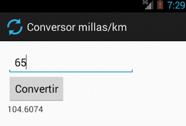
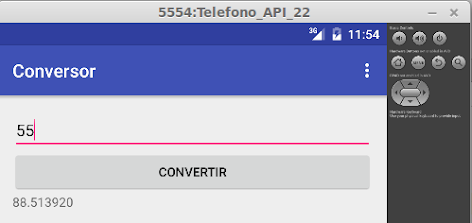

# Conversor de millas a kilómetros

 

Es la primera aplicación básica, nos sirve como ejemplo introductorio.

# Enunciado

El [enunciado](http://algo3.uqbar-project.org/material/ejemplos/dominios/conversor) plantea algunas variantes.

# El proyecto
Este proyecto está generado para

* Android Studio 3.2.1 (Noviembre 2018)
* con Gradle 3.2.1 (el que viene con Android Studio)
* para una SDK 28 (Pie)
* en Kotlin (hay que descargarlo siguiendo [estos pasos](https://kotlinlang.org/docs/tutorials/kotlin-android.html))
* aprovechamos las [Kotlin Android Extensions](https://antonioleiva.com/kotlin-android-extensions/)

# Explicación

Nuestro objetivo es comenzar por una aplicación sencilla y conocida, el conversor de medidas (en este caso sólo de millas a kilómetros). Una vez más vamos a tratar de separar los concerns de vista y modelo, aplicando una nueva variante de MVC



## El modelo

Elegimos introducir un modelo que tenga estado a propósito para no caer en los típicos ejemplos que pueden encontrar en Internet, donde la actividad tiene toda la responsabilidad y termina siendo un God Object.

Ese estado se representa con un objeto **Conversor** que tiene:

* un **valor origen**
* el **valor convertido** a la unidad de medida de destino
* y un método **BigDecimal convertir()**, que retorna el resulto de la conversión.

## La vista

### Elementos gráficos y layout

El concepto que equivale a pantalla o página es actividad, que se define

* en forma visual
* o bien en forma declarativa, a partir de un xml

También podemos crear o configurar elementos en forma programática, utilizando el lenguaje de programación de la SDK (en nuestro caso Java).

Tenemos que aprender a ubicarnos en un proyecto Android, donde tendremos como carpetas:

* `/src`: aquí estarán distribuidos en distintos packages
  * homes
  * objetos de dominio
  * y los controllers de las actividades
* `/res`
  * `layout`: la definición visual o declarativa vía xml de las vistas, de cada actividad. A su vez podemos dividir las subcarpetas
    * `layout`: para la orientación vertical o portrait
    * `layout-land`: para la orientación horizontal o landscape
    * `layout-swXXXdp`: para dispositivos con un tamaño mínimo de XXX píxeles
  *  `drawable`: donde van las imágenes que usa el proyecto, dividido en diferentes carpetas dependiendo de la resolución que va a tener el dispositivo (desde ldpi que es low, mdpi, hdpi, a xhdpi que es extra-high)
  * `menu`: define la barra de herramientas o toolbar con las acciones principales que tiene la aplicación
  * `values`: aquí se ubican los archivos xml para externalizar strings, estilos, colores, lista de valores, etc. Una decisión fuerte del desarrollo con Android es no acoplar los labels, ni los mensajes de usuario a strings hardcodeados sino tenerlos en un archivo separado, de manera de poder internacionalizarlo fácilmente. El costo, por supuesto, es que trae un nivel más de indirección.

hay otros más pero por el momento nos vamos a concentrar en estos puntos

Además en el directorio raíz (`app/src/main`) del proyecto está el archivo AndroidManifest.xml que contiene información importante sobre la versión del sistema operativo de Android mínima y máxima a usar: esto determina qué features podremos utilizar (como menúes contextuales, formas de dividir la pantalla, etc.)

### Definiendo la vista del conversor

Como dijimos antes se puede definir de muchas maneras, vamos a elegir partir de un xml, ubicado en el path   `res/layout` de nuestro proyecto y llamado `activity_conversor.xml`:

```xml
<LinearLayout xmlns:android="http://schemas.android.com/apk/res/android"
    xmlns:tools="http://schemas.android.com/tools"
    android:layout_width="match_parent"
    android:layout_height="match_parent"
    android:background="@android:color/white"
    android:orientation="vertical"
    android:padding="10dp">

    <TextView
        android:id="@+id/conversor_millas_label"
        android:layout_width="match_parent"
        android:layout_height="wrap_content"
        android:text="@string/millas"
        android:textStyle="bold" />

    <EditText
        android:id="@+id/conversor_millas"
        android:layout_width="match_parent"
        android:layout_height="wrap_content"
        android:hint="@string/millas"
        android:inputType="numberDecimal" />

    <Button
        android:id="@+id/conversor_convertir"
        android:layout_width="match_parent"
        android:layout_height="wrap_content"
        android:onClick="convertir"
        android:padding="10dp"
        android:text="@string/convertir" />

    <TextView
        android:id="@+id/conversor_kilometros_label"
        android:layout_width="match_parent"
        android:layout_height="wrap_content"
        android:text="@string/kilometros"
        android:textStyle="bold" />

    <TextView
        android:id="@+id/conversor_kilometros"
        android:layout_width="match_parent"
        android:layout_height="wrap_content"
        android:textSize="40dp"
        android:textColor="#0B173B"
        android:hint="@string/kilometros" />

</LinearLayout>
```

Esto mismo podemos definirlo en forma visual, aunque suele resultar más tedioso cuando la cantidad de controles crece.

* Cada vista tiene un Layout principal, que puede ser
  * **Linear**: Horizontal o Vertical, definida por el atributo `android:orientation`. En el ejemplo del Conversor estamos utilizando una orientación vertical.
  * **Relative**: cada control se ubica en una posición relativa respecto al anterior o al control "padre" (abajo, a derecha, etc.)
  * **ListView**: tiene una lista dinámica de elementos que se pueden navegar de arriba a abajo.
  * **Grid**: en este caso particular la lista de elementos tiene filas y columnas, se pueden navegar de izquierda a derecha además de arriba hacia abajo.
* Los tres controles tienen en la propiedad ancho y alto (`android:layout_width` y `android:layout_height`) el valor `wrap_content`. 
  * **wrap_content** asegura que el tamaño del control se ajuste a su contenido: en el caso de un texto se separa en varias líneas, en el caso de una imagen se reacomoda para que pueda visualizarse entera. En este caso no nos preocupa porque no hay una gran cantidad de información a mostrar, si ése fuera el caso debemos estar atentos a que los controles que siguen se acomodan más abajo, con lo que es posible que en una pantalla con muchos controles el usuario tenga que desplazarse hacia arriba y abajo.
  * El layout utiliza el otro valor posible: **match_parent** indica que vamos a tomar el tamaño del contenedor padre (definido por el tag en el que está encerrando el control). Esto puede truncar una imagen o un texto si el tamaño del contenedor padre no es lo suficientemente grande. 
  * Para más información recomendamos leer [la documentación oficial sobre el manejo de tamaños de los controles](https://developer.android.com/training/multiscreen/screensizes.html)
* Cada control define un **identificador** único (`android:id`, el símbolo `+` permite crearlo si no existe)
* El texto "Convertir" que aparece en el botón se obtiene en forma indirecta, referenciando a una constante que se define en el archivo `strings.xml`, dentro de la carpeta `res/values`

```xml
<resources>
    ...
    <string name="convertir">Convertir</string>
</resources>
```

# El controller (la Activity)

La vista no tiene comportamiento, sólo define cómo se disponen los elementos visuales en un layout. El controller trabaja sobre el comportamiento de la vista, definiendo

* configuraciones adicionales para los controles (sobre todo los que tienen asociado cierta lógica)
* cómo se relacionan los widgets con su correspondiente modelo
* cómo responder ante los eventos de usuario

Esto se resuelve con una clase java (o eventualmente Xtend o Kotlin), en nuestro caso ActivityConversor que hereda de android.app.Activity. 

Para incorporar el comportamiento del botón "Convertir" le pedimos al ActivityConversor que implemente la interfaz onClickListener y además debemos implementar el método `onCreate`:

```kotlin
class ConversorActivity : AppCompatActivity(), View.OnClickListener {
    val conversor = Conversor()

    override fun onCreate(savedInstanceState: Bundle?) {
        super.onCreate(savedInstanceState)
        setContentView(R.layout.activity_conversor)
        conversor_convertir.setOnClickListener(this)
    }
```

Mientras que en Arena la estrategia para agregar comportamiento es trabajar con template methods, es decir, dejar métodos vacíos para que el desarrollador incorpore código de su funcionalidad específica, en Android se trabaja redefiniendo el comportamiento default, lo que nos obliga a llamar siempre al onCreate de la superclase.

## Qué pasa cuando no hay binding

Y... todo es más burocrático. Pasamos a verlo en el `ConversorActivity.kt`:

~~~kt
override fun onClick(view: View) {
    try {
        val millas = conversor_millas.text.toString()
        if (millas.trim().equals("")) {
            Toast.makeText(this.getApplicationContext(), "Debe ingresar un valor", Toast.LENGTH_LONG).show()
            return
        }
        conversor.millas = java.lang.Double.valueOf(millas)
        conversor.convertir()
        conversor_kilometros.text = conversor.kilometrosAsString()
    } catch (e: NumberFormatException) {
        Toast.makeText(this.getApplicationContext(), "Debe ingresar un valor numérico", Toast.LENGTH_LONG).show();
    }
}
~~~

El controller debe encargarse de

* referenciar al EditText valorOrigen y obtener el valor ingresado por el usuario, ubicado en la propiedad text
* convertirlo de string a número
* delegar la conversión al modelo
* tomar el resultado de la conversión (un número) y convertirlo a string
* y finalmente ese string hay que ubicarlo en la propiedad text del TextView que muestra el resultado

El lector podría decir: ¿tanto escándalo por 5 líneas? Claro, esto es solo para mostrar un ejemplo didáctico. Conforme vayamos agregando campos y haya relaciones entre éstos, el controller agrega líneas dramáticamente.

## Filters

Si queremos escribir un caracter en el dispositivo, vemos que ese tipo de input está deshabilitado, porque en la definición del control EditText definimos que el input es numérico:

```xml
<EditText
    android:id="@+id/conversor_millas"
    android:hint="@string/millas"
    ...
    android:inputType="numberDecimal" />
```

_activity_conversor.xml_

## Jugando un poco con la vista

Podemos cambiar la propiedad de los controles EditText, Button y TextView, para que en lugar de utilizar el mínimo tamaño posible (wrap_content) tomen el ancho de la pantalla (match_parent):

```xml
android:layout_width="match_parent"
```

Y vemos reflejado en la vista el cambio:



## Actividades para el curioso

1. Cambiar el look & feel para utilizar una pantalla con el fondo negro y las letras en blanco (lo que se conoce como Dark Theme o Inverse)
2. Cambiar el TextView para que utilice un recuadro de color y el texto con otro color
3. Hacer la conversión a medida que se escribe el valor en el texto (Tip: ver [este tutorial](http://stacktips.com/tutorials/android/android-textwatcher-example))
4. Ubicar todos los controles en una sola línea
5. Ubicar los controles en 2 columnas
    1. fila 1 columna 1 el input
    2. fila 1 columna 2 dice "millas"
    3. fila 2 columna 1 botón convertir
    4. fila 2 columna 2 tiene el TextView
6. Reemplazar el TextView de kilómetros por un EditText para que se pueda convertir de millas a kilómetros o viceversa.


# Testing

* en la carpeta test encontrarás [un archivo de testeo unitario del conversor](app/src/test/java/ar/edu/uqbar/conversorappkot/ConversorUnitTest.kt)
* y un [test de integración básico](app/src/androidTest/java/ar/edu/uqbar/conversorappkot/ExampleInstrumentedTest.java)

