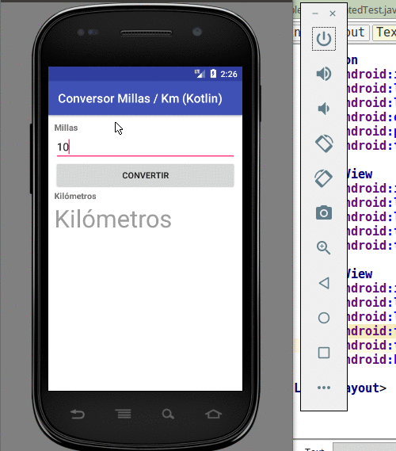

# Conversor de millas a kilómetros

 

Es la primera aplicación básica, nos sirve como ejemplo introductorio.

## Enunciado

El [enunciado](http://algo3.uqbar-project.org/material/ejemplos/dominios/conversor) plantea algunas variantes.

## El proyecto
Este proyecto está generado para

* Android Studio 2.2 (Septiembre 2016)
* con Gradle 2.14.1 (el que viene con Android Studio)
* para una SDK 24 (Nougat)
* en Kotlin (hay que descargarlo siguiendo [estos pasos](https://kotlinlang.org/docs/tutorials/kotlin-android.html))

## La arquitectura MVC

* **La vista**: está definida en un .xml
* **El controller**: es el ConversorActivity
* **El modelo**: es un Conversor definido como Java Bean

No tenemos binding, así que el controller debe manualmente convertir los valores de la vista hacia el controller y viceversa, lo que incluye el manejo de errores.

## Testing

* en la carpeta test encontrarás [un archivo de testeo unitario del conversor](app/src/test/java/ar/edu/uqbar/conversorappkot/ConversorUnitTest.kt)
* y un [test de integración básico](app/src/androidTest/java/ar/edu/uqbar/conversorappkot/ExampleInstrumentedTest.java)

